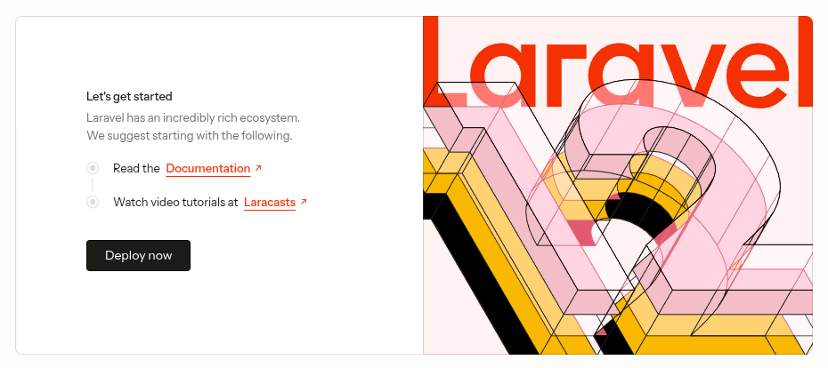

# docker-laravel-nginx-mysql

This project uses Docker to set up a development environment for **Laravel**, **Nginx**, **MySQL**, and **PHP-FPM**.

---

## 🚀 Steps to Start the Environment

### 1. Copy the example environment file
```bash
cp .env.example .env
```

### 2. Update the following variables in the .env file:
- APP_NAME
- SRV_PORT_HOST
- DB_PORT_HOST
- DB_DATABASE
- DB_PASSWORD

### 3. Create a new Laravel project in the src folder
```bash
composer create-project --prefer-dist laravel/laravel src
```

### 4. Build the Docker containers
```bash
docker compose build
```

### 5. Start the Docker containers
```bash
docker compose up -d
```

### 6. Open a shell inside the PHP-FPM container
```bash
docker exec -it APP_NAME-php-fpm bash
```

### 7. Update the following variables in the src/.env file:
- APP_NAME
- SRV_PORT_HOST
- DB_PORT_HOST
- DB_DATABASE
- DB_PASSWORD
  

> 📝 **Note:** You can use the same values as in your .env file. (Check the 2 step above)

### 8. Run migrations
```bash
php artisan migrate
```

### 9. Check the app is running at http://localhost:SRV_PORT_HOST

> 📝 **Note:** You should see some like following:
